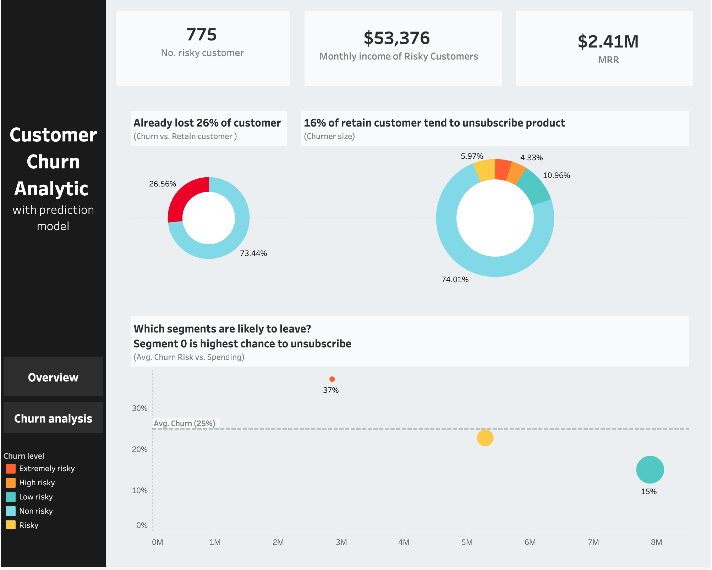
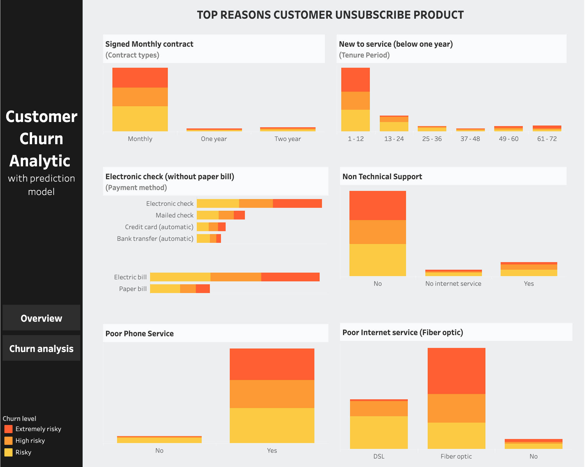
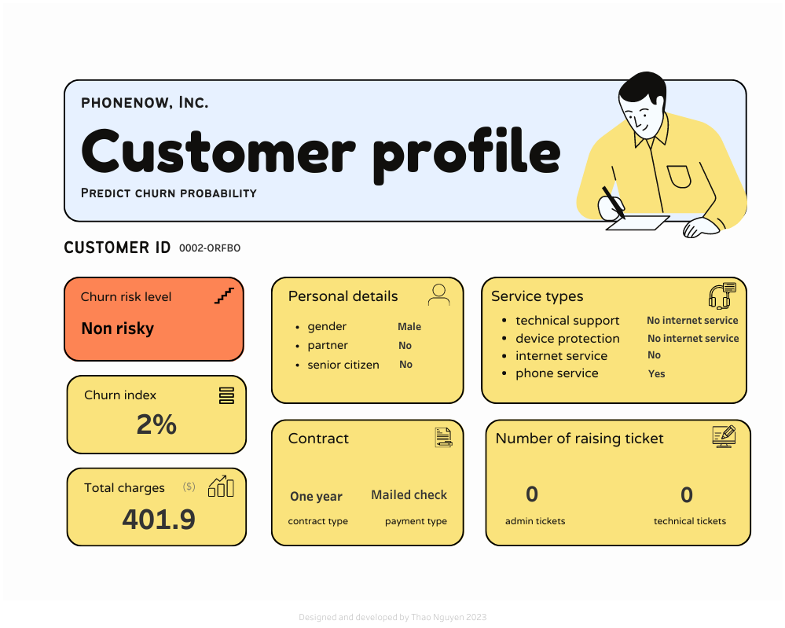
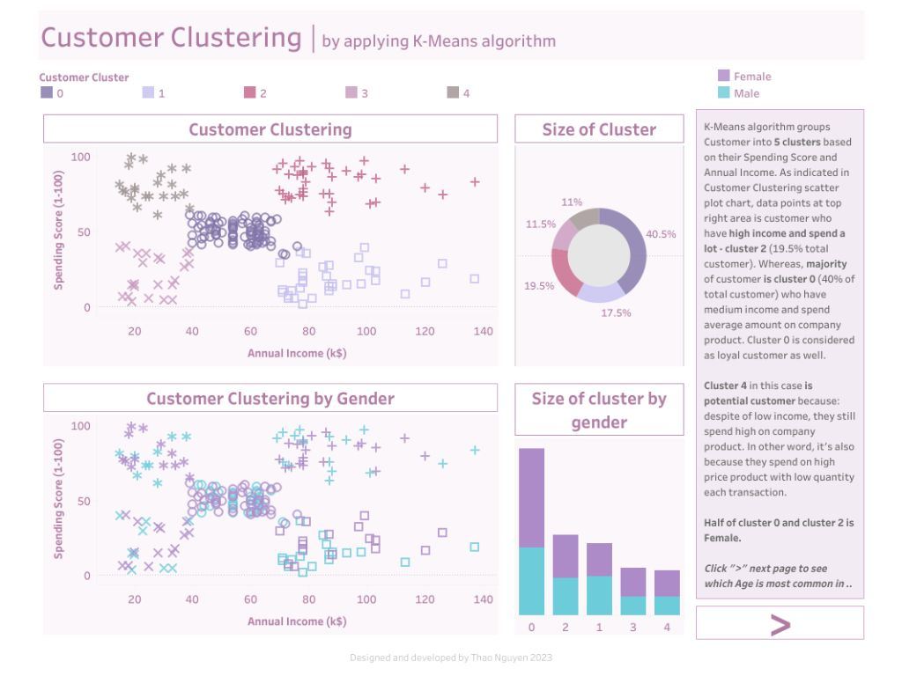
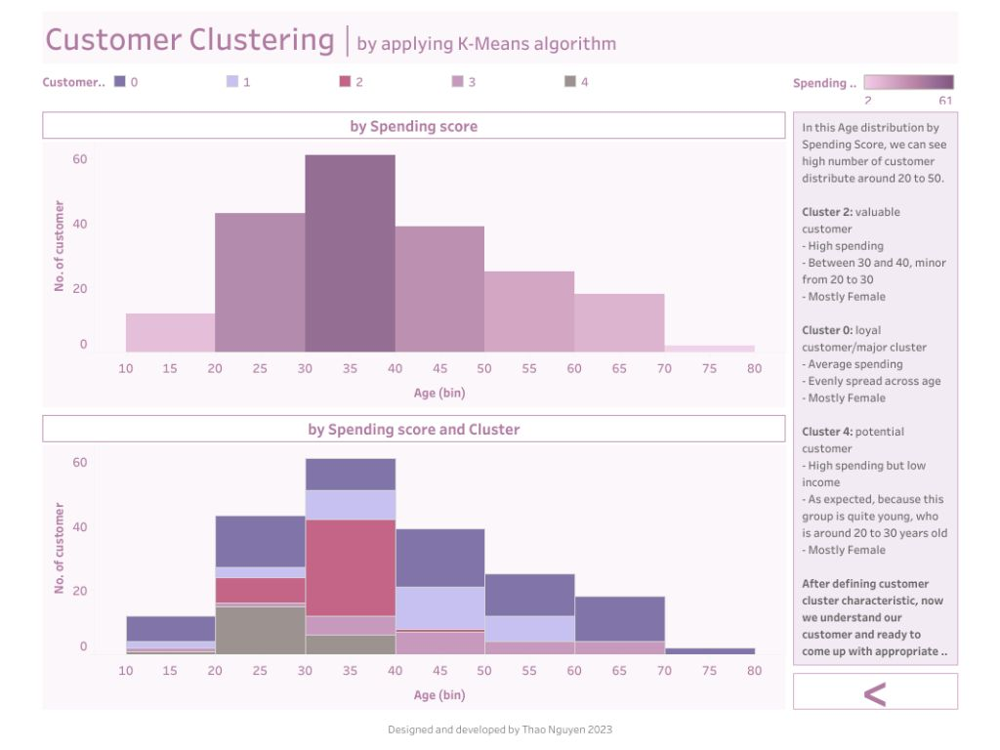

<h1 align="center"> Hi 👋, I'm Thao </h1>

<h4 align="center"> I am life learner, a junior data analytics enthusiast, having working experience in FMCG and finance domain for 4 years. Skilled in data analysis and market research using Python, SQL, Microsoft Excel, Tableau and Power BI. Currently, I focus on predictive and statistical analytics </h4>

🔧 Tools: | SQL | Python | scikit-learn | MS Excel | Power BI | Tableau | Metabase 

🌥 Data warehouse: MySQL Workbench | Google Big Query | IBM Db2

🎓 Certification: IBM Professional Data Analyst Certificate | 
KPMG Virtual Project Certificate (Data Analysis - The Forage) |
Data Camp Customer Analytics & A/B Testing in Python

<h6> 📌 View all projects code <a href="https://github.com/nhthaonguyen?tab=repositories"><strong>HERE!</strong></a> </h6>

Below is some of my analysis with visualization

 👇🏼 Predict churning reasons using machine learning model, visualized in Tableau 👇🏼 

 👇🏼 Predict a customer churn probability using machine learning model, visualized as a report in Tableau 👇🏼 

 👇🏼 Clustering customer using machine learning model, visualized as a report in Tableau 👇🏼 

 👇🏼 Customer Segmentation using Recency-Frequency-Monetary analysis, visualized in Power BI 👇🏼 

 👇🏼 Customer analysis report, visualized in Tableau 👇🏼 

